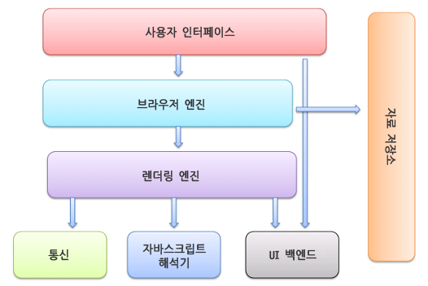

OJT 첫번째 주제인 브라우저의 동작 원리.  
네이버 기술 블로그에 올라온 글을 참고해서 공부하길래 똑같은 글을 읽어봤다.  
근데 이 글도 애초에 탈리 가르시엘이라는 사람의 글을 번역한 글이던데
브라우저 내부와 수백만 줄 분량의 오픈소스 렌더링 엔진의 소스 코드를 직접 분석하여 브라우저 동작을 파악한 사람의 글이라고 한다.. 대단쓰..

## 브라우저의 정의

가장 먼저 브라우저가 무엇인지부터 정의를 보자.  
브라우저는 웹 서버와 쌍방향으로 통신하고 HTML 문서나 파일을 출력하는 그래픽 사용자 인터페이스(GUI) 기반의 응용 소프트웨어이다.  
간단하게 말하면 웹 서버에 저장된 정보를 화면에 표시하는 소프트웨어라고 할 수 있다.
우리가 사용하고 있는 크롬, 사파리, 파이어폭스, 웨일 등이 브라우저다.

## 브라우저의 주요 기능

주요 기능은 사용자가 선택한 자원을 서버에 요청(request)하고 서버의 응답(response)을 받아 브라우저에 표시하는 것이다.
자원은 보통 HTML 문서지만 CSS, Javascript, 이미지, PDF 등 다양한 형태가 될 수 있다.

과거에는 브라우저마다 서로 다르게 데이터를 해석하여 보여줬는데, 이로 인해 웹 개발자가 호환성에 어려움을 겪게 되어 최근에는 대부분의 브라우저가 웹 표준화 기구인 `W3C(World Wide Web Consortium)`의 표준 명세를 따라 구현하고 있다.

브라우저의 사용자 인터페이스는 표준 명세가 없는데도 서로의 장점을 모방하며 현재의 모습이 되었다.
다음은 사용자 인터페이스의 일반적 요소들이다.

- URI를 입력할 수 있는 주소 표시줄
- 이전 버튼과 다음 버튼
- 북마크
- 새로 고침 버튼과 현재 문서의 로드를 중단할 수 있는 정지 버튼
- 홈 버튼

## 브라우저의 기본 구조

이 글이 아무래도 옛날 글이라 그 사이에 기본 구조에 뭔가가 추가되었을라나 해서 검색해봤는데
다 똑같이 이 이미지를 사용하고 있다ㅋㅋㅋ 아무래도 기본 구조니까.. 그런가보다.

#### 사용자 인터페이스 (User Interface)

주소 표시줄, 이전/다음 버튼, 북마크 메뉴 등을 말한다. 요청한 페이지를 보여주는 창을 제외한 나머지 모든 부분이다. 사용자 인터페이스의 일반적 요소라고 말한 것들이 모두 포함된다.

#### 브라우저 엔진 (Browser Engine)

모든 웹 브라우저의 핵심이 되는 구성 요소로, 사용자 인터페이스와 렌더링 엔진 사이의 동작을 제어한다.
사용자가 주소 표시줄에 URL을 입력하면 (사용자 인터페이스) 그걸 전달받은 브라우저 엔진이 찾아오고, 찾아온 데이터를 렌더링 엔진에 전달해 화면에 보여주도록 한다.
즉, 사용자가 어떤 액션을 하는 것부터(사용자 인터페이스) 화면에 결과물로 보여주기(렌더링)까지의 과정에 관여하는 것이다.

#### 렌더링 엔진 (Rendering Engine)

사용자가 요청한 콘텐츠를 표시해주는 역할을 한다. HTML을 요청한다면 HTML과 CSS를 파싱하여 화면에 출력해주는 것이다.

브라우저 엔진을 찾다보면 렌더링 엔진이 나와서 두 개가 같은건가 싶었다.  
[이 블로그](https://codecraft.tistory.com/entry/%EB%B8%8C%EB%9D%BC%EC%9A%B0%EC%A0%80-%EC%9D%B4%ED%95%B4%ED%95%98%EA%B8%B0-2-%EB%B8%8C%EB%9D%BC%EC%9A%B0%EC%A0%80-%EC%97%94%EC%A7%84-%EB%93%A4%EC%97%AC%EB%8B%A4%EB%B3%B4%EA%B8%B0-Webkit)에서만 구분되어 설명해줬다.
그림 상으로는 구분되어 있는데 여러 곳에서 약간 동일하게 말하고 있어서 조금 헷갈림..

근데 보니까 보통 브라우저 엔진은 렌더링 엔진을 의미한다고 하는 것 같고,
브라우저 엔진과 렌더링 엔진의 구분보다는 자바스크립트 엔진과의 구분이 좀 더 의미있는 구분인 것 같다.

브라우저 엔진 및 렌더링 엔진에는 블링크 (Blink), 웹킷(Webkit), 게코(Gecko), 서보(Servo)등이 있다.  
현재 크롬, 엣지, 웨일 등 2010년 이후 등장한 대부분의 브라우저들은 블링크를 사용하고 있다고 한다.
사파리는 웹킷, 파이어폭스는 게코를 사용하고 있다고 한다.

#### 통신 (Networking)

HTTP(HyperText Transfer Protocol) 또는 FTP(file transfer protocol)와 같은 표준 프로토콜을 사용하여 네트워크 호출을 관리하는 역할을 한다. 통신은 플랫폼 독립적인 인터페이스이고 각 플랫폼 하부에서 실행된다.

브라우저는 웹 페이지를 가져오기 위해 대부분의 웹 서버가 사용하는 `HTTP(Hyper Text Transfer Protocol)`로 통신한다.
HTTP는 텍스트, 이미지 및 비디오가 웹에서 전송되는 방식을 정의하는 일종의 약속이다.

#### UI 백엔드 (UI Backend)

콤보 박스와 창 같은 기본적인 장치를 그려준다. 플랫폼에서 명시하지 않은 일반적인 인터페이스로서, 브라우저가 동작하고 있는 운영체제(OS)의 인터페이스를 따르는 UI를 처리한다. OS에 따라 alert이나 selectbox가 다르게 보이는 것이 UI 백엔드의 영향이다.

렌더링 엔진에서 생성된 렌더 트리를 브라우저에 그리는 역할을 한다.

#### 자바스크립트 엔진 (Javascript Engine)

자바스크립트 코드를 해석하고 실행한다. 해석한 결과를 화면에 표시하기 위해 렌더링 엔진으로 전달한다.

#### 자료 저장소 (Data Storage)

자료를 저장하는 계층이다. Local Storage, Session Storage, Cookie 등을 로컬에 저장하는 영역이다. HTML5 명세에는 브라우저가 지원하는 '웹 데이터 베이스'가 정의되어 있다.

## 마무리

내용이 많아서 나눠서 하는걸로..! 조금씩 천천히 체하지 않게 가보자!

 
참고

- [브라우저는 어떻게 동작하는가?](https://d2.naver.com/helloworld/59361)
- [웹 브라우저](https://ko.wikipedia.org/wiki/%EC%9B%B9_%EB%B8%8C%EB%9D%BC%EC%9A%B0%EC%A0%80)
- [[브라우저 이해하기] 2. 브라우저 엔진 들여다보기 (Webkit)](https://codecraft.tistory.com/entry/%EB%B8%8C%EB%9D%BC%EC%9A%B0%EC%A0%80-%EC%9D%B4%ED%95%B4%ED%95%98%EA%B8%B0-2-%EB%B8%8C%EB%9D%BC%EC%9A%B0%EC%A0%80-%EC%97%94%EC%A7%84-%EB%93%A4%EC%97%AC%EB%8B%A4%EB%B3%B4%EA%B8%B0-Webkit)
- [브라우저 기본 구조와 렌더링 과정](https://velog.io/@po05360/%EB%B8%8C%EB%9D%BC%EC%9A%B0%EC%A0%80-%EA%B8%B0%EB%B3%B8-%EA%B5%AC%EC%A1%B0%EC%99%80-%EB%A0%8C%EB%8D%94%EB%A7%81-%EA%B3%BC%EC%A0%95)
