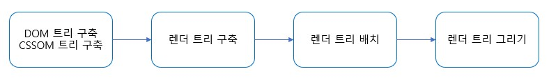
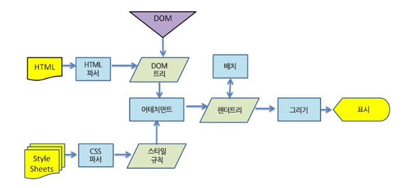

## 렌더링 엔진

렌더링 엔진의 기본적인 역할을 요청 받은 내용을 브라우저에 표시하는 것이다.
프론트 작업 시 브라우저마다 다르게 보이는 경우를 한번쯤 겪어보는데, 브라우저마다 사용하는 렌더링 엔진이 다르기 때문이다.

## 렌더링 엔진들

참고하고 있는 [글](https://d2.naver.com/helloworld/59361)이 아무래도 2012년 글이다보니 크롬에서 웹킷 엔진을 사용하고 있다고 하지만 현재는 전에 얘기했던 것처럼 `블링크`라는 엔진을 사용하고 있다. 블링크는 웹킷을 fork해서 구현된 엔진이다.  
크로미움 기반 브라우저는 블링크(Blink), 파이어폭스는 게코(Gecko), 사파리는 웹킷(Webkit)을 사용하고 있다.

## 동작 과정

렌더링 엔진은 통신으로부터 요청한 문서의 내용을 얻는 것으로 시작한다.

### 파싱과 트리 구축

#### HTML 파싱

렌더링 엔진은 통신으로부터 얻어온 `HTML 문서`를 파싱하여 브라우저가 이해할 수 있는 `DOM(Document Object Model)`으로 변환시킨다. HTML을 파싱할 때에는 HTML파서로 파싱을 하고, 이것은 HTML 마크업을 파싱 트리로 변환해준다. 브라우저가 HTML 파싱을 위해 별도의 HTML파서를 생성하는 것에는 이유가 있다.

1. HTML의 너그러운 속성

HTML에서 시작 또는 종료 태그 등을 생략하는 경우가 있다.
HTML은 암묵적으로 태그에 대한 생략이 가능하다. 이런 부분이 HTML이 유연한 문법을 가지고 있다는 것을 보여준다.

2. HTML에 대한 브라우저의 관용

3. 변경에 의한 재파싱, 스크립트 태그는 토큰을 추가할 수 있어 파싱이 수정될 수 있음

이런 이유들로 일반적인 파서로는 HTML을 파싱할 수 없어 HTML 파서로 파싱을 한다.
파싱 알고리즘은 토큰화와 트리 구축 단계로 되어있다.  
토큰화는 입력값을 토큰으로 파싱하는 과정을 말하는데, HTML에서 토큰은 시작 태그, 종료 태그, 속성 이름과 속성 값이다. 토큰을 인지해 트리 생성자로 넘기고 다음 토큰을 확인하기 위해 다음 문자를 확인한다.

토큰을 읽어 트리를 구축하는 파싱 단계를 거치면 브라우저는 문서(Document)와 상호작용할 수 있게 되고 문서 파싱 이후에 실행되어야 하는 지연 모드 스크립트를 파싱한다. 이때 load 이벤트가 발생한다.

#### CSS 파싱

브라우저는 DOM을 생성하는 동안 css를 불러오는 link를 만나면 즉시 해당 리소스에 대한 요청을 보낸다. css도 브라우저가 이해하고 처리할 수 있도록 변환해줘야 하기 때문에 HTML과 같은 방식으로 파싱하여 CSSOM을 생성한다.

#### 스크립트의 진행 순서

script 태그를 만나면 script를 먼저 파싱하고 실행하게 되어있어 스크립트가 실행되는 동안 문서의 파싱은 중단된다.
src 속성이 있는 외부 스크립트 태그를 만났을 때도 마찬가지이다.  
이런 동작 방식은 스크립트에서 스크립트 아래에 있는 DOM 요소에 접근할 수 없게 하고, 용량이 큰 스크립트가 있는 경우에는 스크립트가 실행될 때까지 페이지를 볼 수 없게 된다.  
그래서 `defer`라는 속성을 사용하면 문서 파싱이 중단되지 않고 파싱이 완료된 이후에 스크립트가 실행될 수 있다.  
비동기로 처리할 수 있는 `async` 속성도 추가되어 별도의 맥락에 의해 파싱되고 실행될 수 있게 되었다.

⭐ defer, async ⭐

1. defer

defer 속성은 외부 스크립트에만 유효하다. script에 src가 없으면 defer 속성이 무시된다.  
브라우저는 defer 속성이 있는 스크립트를 백그라운드에서 다운로드 한다. 따라서 defer 스크립트를 다운로드하는 중에도 HTML의 파싱을 중단하지 않는다. defer 스크립트의 실행은 페이지가 파싱이 끝나고 렌더링을 시작할 때까지(페이지 구성이 끝날 때까지) 기다린 후 실행된다.

DOM이 준비된 후에 실행되긴 하지만 DOMContentLoaded 이벤트 발생 전에 실행된다.  
defer 스크립트는 HTML에 추가된 순으로 실행이 되기 때문에 defer 속성이 정의된 script 태그가 여러개일 경우 먼저 정의된 script가 실행이 된 후에 그 다음 defer 스크립트가 실행이 된다.  
다운로드는 병렬적으로 진행이 되지만 실행 자체는 추가된 순서대로 진행이 된다.

2. async

async 속성이 있는 스크립트는 페이지와 독립적으로 동작한다.
다운로드는 defer와 마찬가지로 백그라운드에서 한다. 따라서 async 스크립트 다운로드를 기다리지 않고 HTML 페이지의 처리가 진행된다. 하지만 async 스크립트의 실행 중에는 HTML 파싱이 멈춘다.

또 다른 점은 DOMContentLoaded 이벤트와 async 스크립트는 서로를 기다리지 않는다는 것이다.
defer 스크립트가 끝난 후에 DOMContentLoaded이벤트가 발생했던 것과 달리  
async 스크립트는 DOMContentLoaded의 전후로 실행될 수 있다.

다른 스크립트 또한 async 스크립트를 기다리지 않고 async 스크립트 또한 다른 스크립트를 기다리지 않는다.
그렇기 때문에 async 스크립트가 여러개 있는 경우에는 실행 순서가 제각각 다르다. 실행은 다운로드가 끝난 스크립트 순서대로 진행이 된다.

이러한 특징으로, async는 스크립트가 독립적인 역할을 할 때 유용하다.

### 렌더 트리 구축

DOM 트리와 CSSOM을 결합하여 렌더 트리가 구축된다.
렌더 트리는 실제로 화면에 표시되는 요소만 추려서 트리 형태로 만들고 표시해야할 순서대로 그려낼 수 있도록 트리를 생성한다. 이 단계를 Attachment 라고 한다.

렌더 트리는 시각적 속성이 있는 사각형을 포함하고 있다. 너비, 높이, 위치와 같은 기하학적 정보도 포함되어 있다.

#### DOM 트리와 렌더 트리

이 둘은 1:1로 대응하는 관계가 아니다. 위에서 말한 것처럼 렌더 트리에는 실제 표시되는 요소만 있기 때문에 head와 같은 비시각적 요소는 포함되지 않는다. 또한 `display: none`이 할당되어있는 요소도 렌더 트리에 포함되지 않는다.

여러 개의 DOM 요소와 대응하는 렌더 트리 요소도 있기도 하고(ex. select)  
서로 동일한 위치에 있지 않는 경우도 있다. (float, position 속성 사용 요소)

렌더 트리 생성이 끝나면 각 노드가 화면의 정확한 위치에 표시되는 `배치`가 시작되며, UI 백엔드에서 렌더 트리의 각 노드를 가로지르며 형상을 만들어내는 `그리기` 과정으로 이어진다.

위의 과정들은 점진적으로 진행이 된다. 모든 HTML을 파싱할 때까지 기다리지 않고 렌더 트리 배치와 그리기 과정을 시작한다.

⭐ display: none 과 visibility: hidden

`display: none`은 요소가 보이지 않고 렌더 트리에서도 요소룰 제거하지만
`visibility: hidden`는 요소를 보이지 않게 하지만 공간을 차지하고 있어 비어있는 사각형으로 렌더링 된다.

### 렌더 트리 배치

렌더 트리가 생성되면 브라우저의 뷰포트 내에서 각 노드들의 정확한 위치와 크기를 계산한다. 이 때 %, vh, vw와 같이 상대적인 위치, 크기 속성은 모두 실제 그려지는 px 단위로 변환되며 이 과정을 `Layout`(배치)이라고 한다.

배치는 왼쪽에서 오른쪽, 위에서 아래로 진행된다. DOM 트리, CSSOM 트리가 변경될 때마다 재구성되는데 이걸 Reflow라고 말한다.DOM 요소의 기하학적 속성이 변경되거나, 화면의 크기가 변경될 때 reflow된다.

요소 하나의 변경이 주변 요소들의 위치와 크기에 영향을 주고, 그 주변 요소들이 또 다른 요소들에게도 영향을 미치게 되어 결국에는 DOM 트리 전체에 대한 계산 작업이 발생하게 된다.  
그러면 렌더 트리가 다시 업데이트가 되고 그리기 단계까지 진행이 되면서 화면에 표시가 된다. 작업 비용이 크다는 것을 알 수 있다.

Reflow가 일어나는 대표적 예는 다음과 같다

- 브라우저 리사이징 (뷰포트 크기 변경)
- 노드의 추가 및 제거
- 요소의 위치, 크기 변경
- 폰트 변경과 이미지 크기 변경

### 렌더 트리 그리기

렌더 트리의 배치가 끝나면 실제 화면을 그린다. 그리기 단계에서는 화면에 내용을 표시하기 위한 렌더 트리가 탐색되고 렌더러의 `paint` 메서드가 호출된다. 그리기는 UI 기반의 구성 요소를 사용한다.

처리해야하는 스타일이 복잡할 수록 paint 단계의 소요시간이 길어지게 되는데, background-color, color 등의 단색 처리는 속도가 빠르지만 그라데이션이나 그림자 효과 등의 스타일은 paint 단계의 소요시간이 비교적 더 오래 소요된다.

Reflow가 일어나면 실제 화면에 표시되기 위해서는 paint 과정도 다시 수행이 되어야 하고, 이 과정을 `Repaint`라고 한다.
Reflow가 일어났을 때만 Repaint가 실행되는건 아니고 기하학적 변화가 아닌 이미지, 색상과 같은 요소들이 변할 경우, layout 부분을 생략하고 (계산 생략) paint 작업이 진행된다. (ex. background-color, opacity 변경)

참고

- [브라우저는 어떻게 동작하는가?](https://d2.naver.com/helloworld/59361)
- [DOM 소개](https://developer.mozilla.org/ko/docs/Web/API/Document_Object_Model/Introduction)
- [defer, async 스크립트](https://ko.javascript.info/script-async-defer)
- [브라우저 렌더링 과정](https://ppoote.tistory.com/172)
