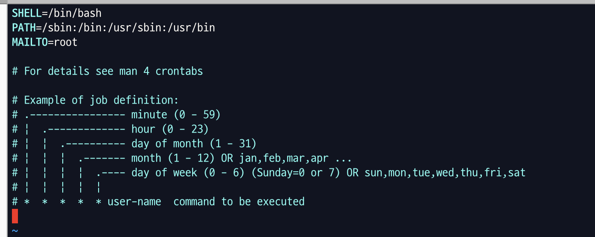

서비스를 개발하다보면 주기적으로 처리되어야 하는 작업들이 있다.  
우리 서비스에서는 테스트로 넣었던 주문들의 상태를 취소 상태로 변경하는 것을 주기적으로 처리하고 있고,
Let's Encrypt SSL 인증서를 3개월마다 자동 갱신할 수 있도록 처리해놓기도 했다.  
현재 개발 중인 서비스에서는 5분마다 결제 완료된 주문 정보를 찾아 주문 데이터를 생성할 수 있는 과정이 필요했고,  
위의 모든 상황은 crontab의 설정으로 처리하고 있다.

## cron과 crontab의 정의

### cron

`cron`은 유닉스 계열 컴퓨터 운영체제의 시간 기반 잡 스케쥴러이다. 좀 더 이해하기 쉽게 말하자면 유틸리티 소프트웨어로 스케쥴링 서비스의 이름이다.  
일반적으로 백그라운드에서 계속 실행되고, 미리 정의된 작업을 예약 실행한다.  
위에서 말했던 것처럼 주기적으로 실행해야하는 작업들에 사용한다.

시스템에서 기본적으로 사용하고 있는 cron 설정은 시스템cron이라 하고 root나 일반 사용자가 자신의 cron 설정을 직접하는 경우에는 사용자cron이라고 한다.

### crontab

cron은 주어진 일정에 주기적으로 실행하도록 규정해놓은 `crontab` (cron table) 파일에 의해 구동된다.  
crontab 파일은 주기적으로 실행될 명령들로 구성된다.  
이것도 쉽게 말하자면 cron 이라는 스케쥴링 서비스에서 반복적으로 실행시킬 내용들을 정의해놓은 파일이 crontab이라고 생각하면 된다.

### crond

crond 는 cron daemon을 의미한다.  
cron을 얘기할 때 백그라운드에서 실행된다고 했는데, 컴퓨터 용어로 daemon의 의미가 백그라운드에서 돌면서 여러 작업을 하는 프로그램을 말한다.  
crond는 백그라운드에서 실행되고 crontab 파일을 읽는 daemon의 이름이다.
실제로 crontab의 내용을 읽어와 실행하는 것의 이름이 crond 이기 때문에 crontab의 내용이 변경되면 crond 서비스를 재시작해줘야 한다.

## crontab 설정

crontab을 설정하는 방법에 두 가지가 있다.

```
# vi /etc/crontab

# crontab -e
```

차이점은 `/etc/crontab`에 설정할 때는 사용자(user)까지 명시를 해줘야 하지만 `crontab -e`로 편집할 때는 쓰지 않아도 된다는 것이다.  
어떤 기준으로 어디에 설정을 하는건지는.. 잘 모르겠다..  
관리자 권한이 있으면 /etc/crontab, 없으면 crontab 명령어로 한다고도 하는데..  
일단 우리 서비스에서는 root에서 crontab 명령어를 사용해 crontab 설정을 하고 있긴 하다.

### crontab 명령어로 설정하기

crontab 명령어에는 여러 옵션이 있다.

- crontab -e : 실행시킬 명령어 등록 및 편집
- crontab -l : 등록되어있는 crontab 설정 확인
- crontab -r : 현재 crontab에 설정되어있는 내용 삭제
- crontab -u : 특정 user의 crontab을 설정할 때
- crontab -i : crontab 내용 삭제 전 확인 문구 띄움

### /etc/crontab에 설정하기

/etc/crontab을 편집기로 열어 설정할 수 있다.



`* * * * * [user-name] [command]` 형태로 설정해야한다.

## 주의사항

직접 겪고 쓰는 주의사항..? 이라기보다 설정 시 확인해야할 사항이다.

### 파일 권한 확인

추가하려던 내용이 curl을 사용해 API를 호출하는 쉘 스크립트의 실행이였다.
cron이 원하는 시간 설정대로 제대로 실행은 되고 있는데 API는 호출이 안되고 있었어서 도대체 뭐가 문제인가.. 쉘스크립트를 잘못 썼나.. 하다가 문득 파일 권한 설정에 대해 생각이 나서 확인해보니 `-rwx-r--r--` 이렇게 되어있었나.. 암튼 group과 모든 사용자의 권한에 execute가 없었다.

그래서 그런건지 쉘 스크립트를 잘 읽어가긴 했는데 실행이 안된 것 같았다..ㅠㅠ
파일 권한에서 execute 권한 추가해주니 바로 쉘 스크립트 실행이 잘 되었다.

만약 로그를 확인했는데 아무 에러가 없는데 쉘 스크립트가 실행이 안되는 것 같을 땐 파일의 권한이 잘 설정되어있는지 확인해보는 것이 좋다!

## 마무리

crontab 설정할 때마다 매번 찾아보게 되서 마침 또 다른 cronjob 등록할 상황이 생겨 정리하게 되었다.  
글 안보고도 바로 설정할 수 있으면 좋긴 하겠지만 만약 헷갈린다면 이젠 내 블로그 봐야지~!

참고

- [cron](https://ko.wikipedia.org/wiki/Cron)
- [Difference between cron, crontab, and cronjob?](https://stackoverflow.com/questions/21615673/difference-between-cron-crontab-and-cronjob)
- [Difference between Cron and Crontab?](https://stackoverflow.com/questions/21789148/difference-between-cron-and-crontab)
