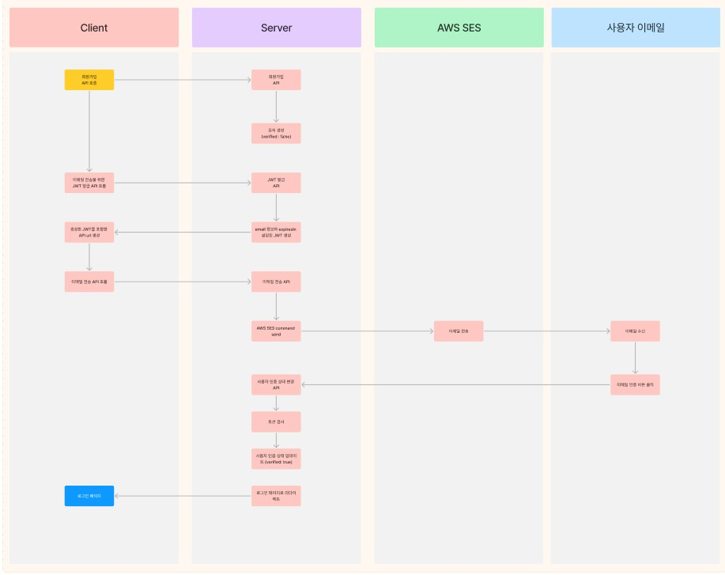
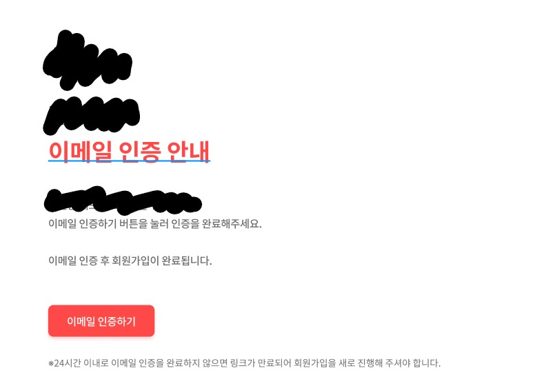

## 구현하려는 이메일 인증 플로우

간단하게 동작으로만 플로우차트를 그려봤다. (자세한 API 내부 동작 플로우 생략)



## 1. JWT 발급

회원가입 이메일 인증에 `JWT`를 사용했다.  
`payload에는 email` 정보만 두고 `expiresIn을 24시간`으로 설정했다.
처음에는 유효시간을 30분으로 설정하고 만료된 토큰이 포함된 링크로 접속하면 인증 메일을 다시 전달받을 수 있도록 하려고 했는데,
팀원들과 상의하여 유효시간은 24시간으로 두고 그 안에 인증하지 않으면 유저 정보를 삭제하는걸로 정했다.  
이렇게 한 이유는 이메일 인증이 회원가입의 최종 단계로서 인증이 되지 않으면 로그인을 할 수 없는데, 실제로 사용하려는 유저라면 보통 바로 인증하기 때문에 24시간 내에 하지 않았다는건 사용하려는 의지가 없다라고 판단해서 삭제하기로 했다.  
다른 곳들은 어떻게 하는지 궁금해..

이렇게 발급받은 JWT는 API에서 만료시간 email 정보를 얻기 위해 사용된다.

## 2. 이메일 전송하기

회사에서는 `AWS SES`를 이용하고 있다. 회원가입 이메일 인증을 위한 템플릿은 미리 만들어두고 메일 내 `이메일 인증 버튼`에는 templateData를 전달받을 수 있도록 설정해두었다.

백엔드에서 만든 이메일 전송 API는 프론트에서 전달해주는 이메일 템플릿 타입, email 주소, templateData를 전달받아 이메일 전송 command를 생성하여 호출하는 역할을 하도록 만들었다.

```typescript
interface ISendEmailBody {
  template: string;
  email: string;
  templateData: string; // JSON.stringify
}

const emailRequestData = {
  Source: "보내는 사람 이메일",
  Destination: {
    ToAddresses: [email],
  },
  Template: template,
  TemplateData: templateData ?? `{}`,
};
const command = new SendTemplatedEmailCommand(emailRequestData);
await this.sesClient.send(emailCommand);
```

메일 내에 있는 이메일 인증 버튼에 백엔드 API의 endpoint를 설정하기 위해 templateData에는 템플릿에 설정한 변수(key)와 거기에 넣을 값을 객체 형태로 만든 후 string으로 전달해야한다.

참고로 SendTemplatedEmailCommand 사용하면 templateData가 필수값인데, `''`, `'null'` 이런식으로 보내면 전송이 안되고 `{}` 이렇게 보내야 한다.

<br />

💡 Amazon Simple Email Service (SES)  
사용자의 이메일 주소와 도메인을 사용해 이메일을 보내고 받기 위한 경제적이고 손쉬운 방법을 제공하는 이메일 플랫폼이다.

## 3. 사용자 인증 상태 변경 API 호출



위처럼 이메일을 수신하면 사용자는 이메일 인증하기 버튼을 클릭해 인증하게 된다.  
저 버튼의 href에는 백엔드 API의 endpoint가 정의된다.

클릭해서 호출된 API는 사용자의 인증 상태를 변경해주는 API이다.  
쿼리스트링으로 `token=<JWT>`을 받고,
전달받은 JWT를 verify해서 확인을 하고 유효한 경우에만 다음으로 진행한다.

JWT가 유효한 경우, 서비스 정책상 이메일 인증이 된 사용자만 로그인할 수 있도록 하고 있어서 이메일 인증 상태를 나타내는 필드를 true로 업데이트 해준다.

그리고 24시간 내에 인증을 하지 못하면 유저 정보를 삭제하도록 하고 있기 때문에,  
회원 가입 시 expiredAt을 24시간 이후로 설정하여 저장하고, (해당 필드는 ttl 설정 - mongoDB)
이메일 인증이 되면 null로 변경해줘야 한다.

## 4. 리다이렉트

어떻게 해야하는건지 생각을 못했는데 아주 쉽게 해결된 부분이다.  
사실 지금 생각해보니까 검색할 때 리다이렉트라고 검색해놓고 왜 response.redirect를 사용할 생각을 못했는지 의문...😅

NestJS를 사용하고 있어 response 객체를 사용하진 않고 `@Redirect()`를 사용했다.

```typescript
@Redirect("리다이렉트 주소")
  async emailAuthentication(@Query('token') token: string) {
    try {
      return await this.authService.updateVerifiedStatus(token);
    } catch (err) {
      return { url: "리다이렉트 주소" }; // token 인증에 오류 발생하면 홈 화면으로 리다이렉트
    }
  }
```

에러 발생 시 `{url: "리다이렉트 주소"}`를 리턴하고 있는데,  
이렇게 하면 위에 데코레이터에 사용한 주소가 아닌 새로 리턴한 주소로 리다이렉트 시킨다.  
[공식 문서](https://docs.nestjs.com/controllers#redirection)를 참고하면 된다.

## 마무리

다행히 생각했던대로 만들어낼 수 있었던 것 같다.  
다만 다른 곳에서는 유효시간을 두고 어떻게 인증하게 하는지는 조금 궁금함..  
메일 전송 계속 다시 할 수 있게 하는지..

AWS SES랑 redirect, forward는 다른 글에서 다시 한번 정리해보자~
